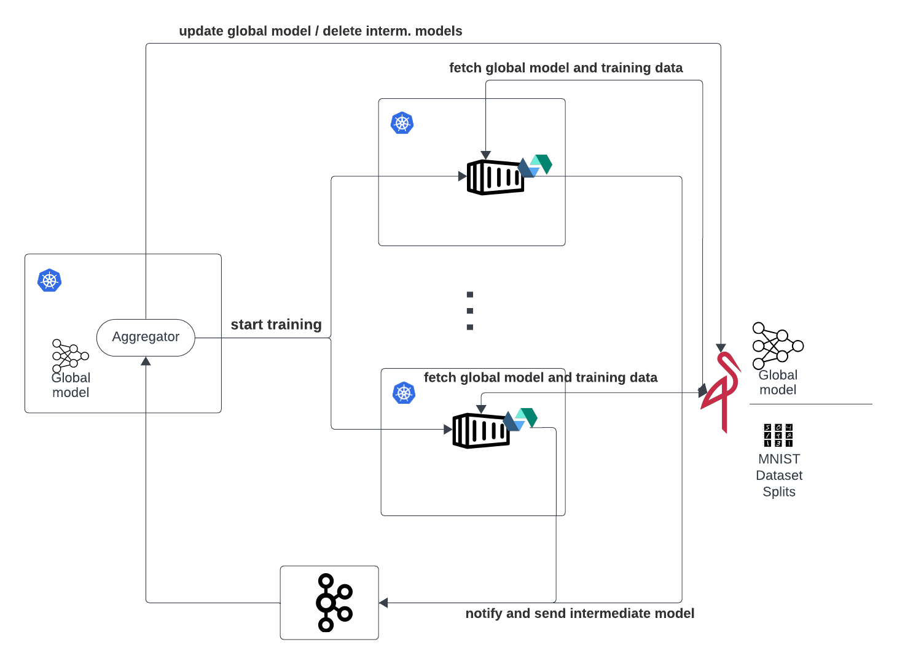

# Serverless Federated Learning

**The assignment component within the academic course 'VU Serverless Computing WS-2023.'**

## Technologies used

| Purpose | Technology |
| ------ | ---------- |
| Serverless platform | Openwhisk |
| Object Storage |  Minio |
| Coordination / Messaging |  Kafka |
| Machine Learning | scikit-learn |
| Local Development Environment | kind ~ Kubernetes in Docker |


## TODOs / Issues

- currently the actions need to be manually warmed up before starting training.
- EMNIST instead of MNIST
- add links to the above technologies

## Setting up the resources necessary for FL

Run:
```
./setup-everything.sh
```
Optionally change permissions so it is executable:
```
chomd +x setup-everything.sh
```


## Starting FL

After setup the main-app, it gets served on localhost:5000.

To start training navigate to `/learn` and optionally pass the arguments with url params: `/learn?nclients=10&nrounds=10&nselected=5`

Default values are:
- nclients=3
- nselected=3
- nrounds=5

Each round starts `nclients` and each client gets one split. As soon as the 50 splits get used the splits start getting re-used. After `nselected` model updates have been received, the round is finished and these are merged and saved as a new global model, which is then used in the next round.

## Visualization

The solution is visualized in the following diagram:

